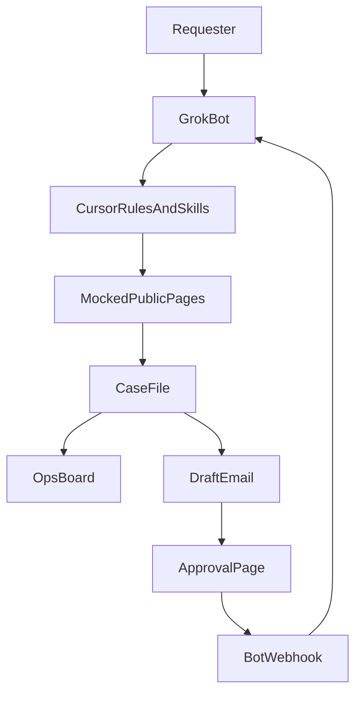
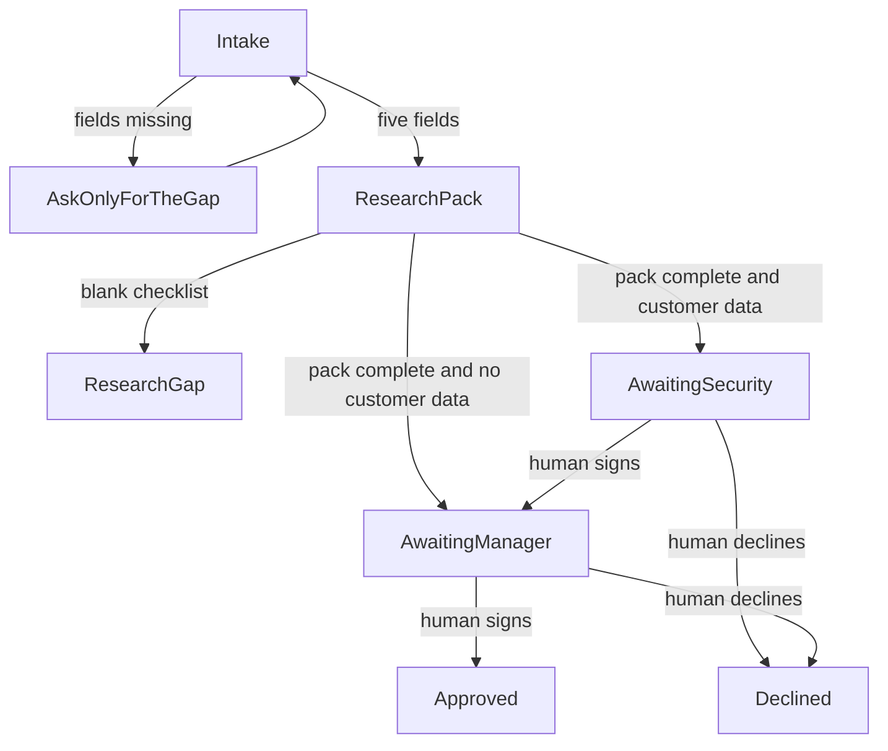

# Acme vendor onboarding

Maya Chen asked for a governed workflow, not another spreadsheet chase.

Intake, a public research pack, then approval routing.

Grok Bot is the front door. The case file in Cursor is the record.

<!--
Open on Maya. One process, three example requests. Say the companies are fictional and the websites are mocked.
-->

---

# What hurts today

1. Intake arrives as "onboard Vendor X." Required fields are missing, and Ops re-asks by email.
2. Research is copy-paste into a shared doc. Nothing defines enough.
3. The manager reviews when they notice the thread. Security is pinged late, and only sometimes.
4. End to end is 1–2 weeks of handoffs. The target is 1–2 days, limited by the human review.

<!--
Do not invent a dollar ROI. The cycle-time numbers are Maya's, not a measured baseline.
-->

---

# What done means

- The requester starts in one place and can ask the bot for status.
- Research uses public sources only. In this room those pages are mocked.
- A human signs before anything is approved.
- Ops opens `/ops/` and sees what was automated against what still needs a person.
- Security can ask the bot what it may read and who may sign, then open the same words as a rule.

<!--
Point at the last two bullets. Those are the lines we prove later, on /ops and in the bot.
-->

---

# Three submissions

| Case | Automated | Needs a person |
| --- | --- | --- |
| VND-1101 Contoso | Five fields kept, pack built, Security opened | Marcus Adeyemi |
| VND-1102 Initech | Three fields kept, website and data-touch filled, manager opened | Riley Chen |
| VND-1103 Globex | Four fields found, owner not on the public site | The Acme business owner |

Every request becomes a row in `cases/ledger.md` when intake starts.

<!--
The rows are different on purpose. Contoso waits on Security. Initech skips Security. Globex has no approval link.
-->

---

# Where the work sits

The bot does not load `.cursor/rules` by itself. The same instructions are pasted into the bot.

<!--
One bot. A second bot is not a security boundary because the account shares one computer.
The API is not on this diagram as a built path. Mention it only if asked.
-->

---

# How the bot stops

Agents may set the waiting states. They may not set approved or declined.

<!--
Contoso is awaiting Security. Initech is awaiting the manager. Globex is still intake, because the owner is missing.
-->

---

# Ops and Security

Ops opens `/ops/`. The board and the bot use the same two headings: Automated, and Needs a person.

Security asks the bot:

- What can you read?
- What are you allowed to change?
- Who is allowed to approve?

Then open `.cursor/rules/acme-boundaries.mdc`. Then run the validator. A customer-data case marked approved with no human signature fails.

<!--
Conversational first, then the file, then the failing fixture. That is the Security line.
-->

---

# What we run

| Step | Live or mocked |
| --- | --- |
| This deck | Live site |
| Three messages on `/dataset/` | Mocked text, real bot |
| Case file, rules, skills | In Cursor, pre-seeded |
| `node scripts/validate-case.mjs` | Live |
| `/approval/` click | Live when the webhook env vars are set |
| Grok API | Not built |

The handoff the bot prints is the top of the case: See it in Cursor.

<!--
If the webhook key is not set, say the decision stayed on the page. Do not pretend the bot moved.
Close by naming the two proof lines again.
-->
